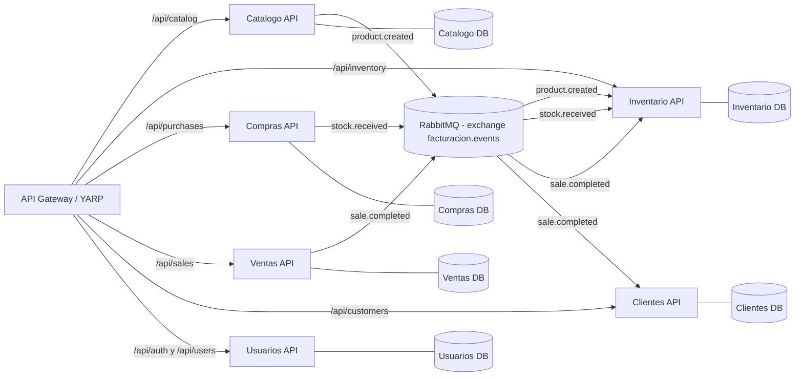

# Interaccion entre modulos (microservicios)

Este documento describe como se comunican los modulos segun la configuracion actual, incluyendo un flujo real de ejemplo.

## Diagrama de interaccion

## Paso a paso: ejemplo real

**Caso:** el usuario crea un producto, se recibe una compra de stock y luego se vende una unidad.

1. **Catalogo:** el usuario crea el producto "Leche 1L" via `POST /api/catalog/products`.
2. **Catalogo publica evento:** se emite `product.created` en RabbitMQ con el ProductId.
3. **Inventario consume evento:** al recibir `product.created`, crea el registro de stock con cantidad inicial 0.
4. **Compras:** se registra una compra de 100 unidades via `POST /api/purchases`.
5. **Compras marca recibida:** al marcar la compra como recibida, publica `stock.received`.
6. **Inventario consume evento:** incrementa el stock con +100.
7. **Ventas:** se realiza una venta con 1 unidad via `POST /api/sales`.
8. **Ventas publica evento:** emite `sale.completed` con los items vendidos.
9. **Inventario consume evento:** descuenta 1 unidad del stock.
10. **Clientes consume evento:** registra el historial de venta y puede sumar puntos.

## Notas de comunicacion

- **Eventos compartidos:** definidos en `Shared/Facturacion.Shared`.
- **Exchange:** `facturacion.events` (RabbitMQ).
- **Gateway:** centraliza rutas y evita que el frontend hable directo con los servicios.
